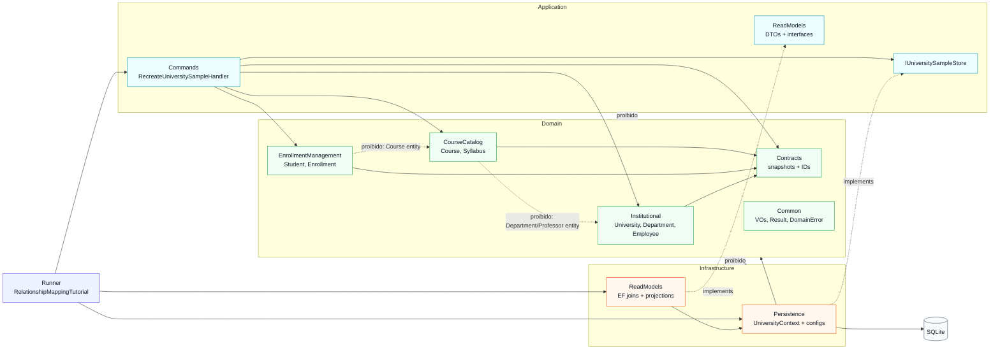
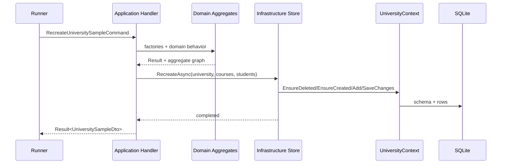

# Tutorial08 - fluxo de camadas

## Veredito

O tutorial usa camadas dentro de um unico `.csproj`. A separacao e por pasta,
namespace e checks de arquitetura, nao por assembly. O dominio ficou livre de
EF Core e de infraestrutura; bounded contexts nao seguram entidades de outro
contexto. O acoplamento com SQLite/EF fica em `Infrastructure`.

| Camada | Responsabilidade | Pode depender de | Observacao |
| --- | --- | --- | --- |
| `Domain` | Regras, aggregates, VOs, `Result` | BCL e tipos do proprio dominio | Sem EF, sem `DbContext`, sem annotations de persistencia |
| `Application` | Commands, DTOs e interfaces finas | `Domain` | Nao conhece `Infrastructure` nem EF |
| `Infrastructure` | EF Core, SQLite, queries e storage | `Application`, `Domain` | Implementa contratos finos com `UniversityContext` |
| `Runner` | Composition root do tutorial | Todas as camadas | Monta EF e injeta infra nos handlers/readers |

## Dependencias



## Fluxo do command



## Leitura

Read models seguem outro caminho: o runner chama contratos de leitura, as
implementacoes em `Infrastructure/ReadModels` fazem joins por IDs no EF e
retornam DTOs simples. Nenhuma query devolve entidade de dominio como contrato
do consumidor.

## Checks

```bash
rg -n "Microsoft.EntityFrameworkCore|UniversityContext|Infrastructure|Persistence" src/EFCore10.Tutorials.Tutorial08/Domain src/EFCore10.Tutorials.Tutorial08/Application -g '*.cs'
rg -n "System.ComponentModel.DataAnnotations.Schema|\\[NotMapped\\]" src/EFCore10.Tutorials.Tutorial08/Domain -g '*.cs'
rg -n "namespace EFCore10\\.Tutorials\\.Tutorial08\\.Persistence|using EFCore10\\.Tutorials\\.Tutorial08\\.Persistence" src/EFCore10.Tutorials.Tutorial08 -g '*.cs'
```
